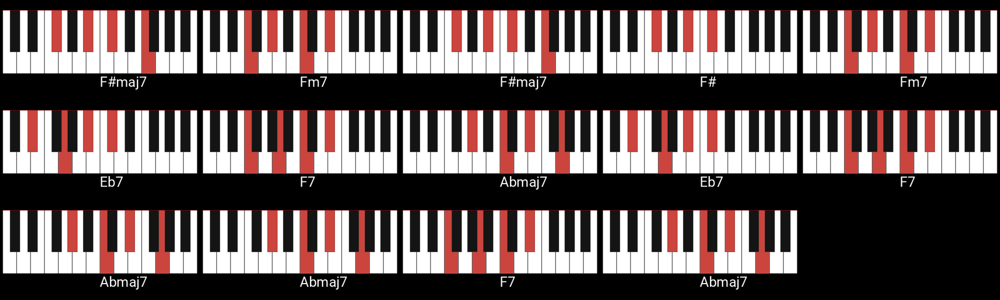

# Piano Chord Set Downloader

This tool can be used to generate image diagrams of piano chords so that it can be played easily for beginners.

## Python Version
- Requires 3.11+

## Install Deps
```bash
pip install -r ./requirements.txt
```

## Generated Sample Image




## How to Use

Currently you can just edit the `main.py` for your desired outputs. I belive the code is not that complicated to make it work for you.

I am working on a CLI application that would make the process easier.